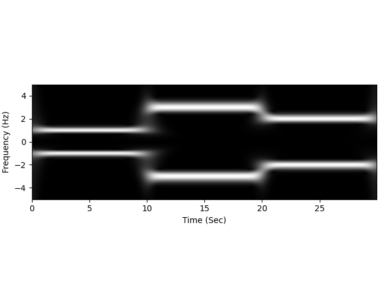
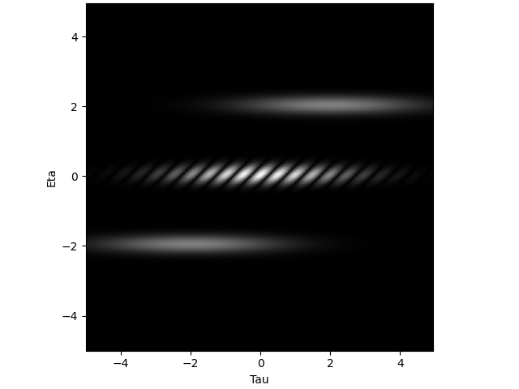

# S Transform and Ambiguity Function

This package provides implementations of S transform and ambiguity function in Python.

Required Packages (install via `pip`):

```bash
pip install numpy==1.23.2
pip install matplotlib==3.5.1
```


## S Transform

Given signal $x(t)$, the S transform calculates the function

$$ S_x(t, f) = \|s(f)\| \int_{-\infty}^{\infty} x(\tau) \exp[-\pi (t-\tau)^2 s^2(f)]\exp[-j2\pi f \tau] \,d\tau $$

We compute it via convolution. That is,

$$ S_x(t, f) = \|s(f)\| \Big( x(t)\exp(-j2\pi ft) \; \ast \; \exp(-\pi t^2s^2(f)) \Big) $$

### Usage

One can directly import the function in python via

```python
from strans import ST
```

Function prototype:

```python
def ST(x, T, F, s = None):
    '''
    S Transform
        x: signal, in callable form
        T: time indices in list
        F: frequency indices in list
        s: general parameter function, in callable form
    '''
```

* `x`: Signal. It should be given a function of parameter of time.
* `T`: TIme indices in interest. It should be given in a list.
* `F`: Frequency indices in interest. It should be given in a list.
* `s`: Adjustable function $s(f)$ (see above formula). Usually a positive increasing function with decreasing first-order derivative. When not given, the default value is $s(f) = 0.3 |f|^{0.7} + 0.1$.

### Example

The following code script computes the S transform of the signal

$$ x(t) = \begin{cases} \cos(2\pi t) & 0 \leq t < 10 \\
\cos(6\pi t) & 10 \leq t < 20 \\
\cos(4\pi t) & 20 \leq t < 30 \end{cases} $$

```python
$ Python 3.8.9
>>> import numpy as np
>>> import strans
>>> dt, df = 0.05, 0.05
>>> T = np.arange(0, 30, dt)
>>> F = np.arange(-5, 5, df)
>>> def x(t):
...     if t < 10: return np.cos(2 * np.pi * t)
...     elif t < 20: return np.cos(6 * np.pi * t)
...     else: return np.cos(4 * np.pi * t)
...
>>> def s(f):
...     return (0.3 * abs(f)**0.7) + 0.1
...
>>> X = strans.ST(x, T, F, s)
>>> strans.show_image(X, extent = (T[0], T[-1], F[0], F[-1]))
```

The given `show_image` function will import `matplitlib` to output the spectrum:



One can see S transform has a better frequency resolution when the frequency is small, and a better time resolution when the frequency is higher.

Note one can also directly execute file `strans.py` as the main program. It will output the spectrum of the Gabor transform and S transform of the same signal. 


## Ambiguity Function

Given signal $x(t)$, the ambiguity function is

$$A_x(\tau, \eta) = \int_{-\infty}^\infty x(t + \tau/2)x^*(t - \tau/2) \exp(-j2\pi t \eta) \, dt $$

We apply a FFT-based algorithm, which requires the following:

1. The signal should only exists in a given limited range.
2. The given sampling length for time $\Delta t$ and output $\Delta \eta$ should follow $N = \frac{1}{\Delta t \Delta \eta}$ larger than length of signal.

### Usage

One can directly import the function via

```python
from ambiguity import Ambiguity
```

Function prototype:

```python
def Ambiguity(x, T, Tau, Eta):
    '''
    Ambiguity Function
        x: signal, in callable form
        T: time indices in list
        Tau: tau indices in list
        Eta: eta indices in list
    '''
```

* `x`: Signal. It should be given a function of parameter of time.
* `T`: TIme indices in interest. It should be given in a list.
* `Tau`: $\tau$  indices in interest (see above formula). It should be given in a list.
* `Eta`: $\eta$  indices in interest (see above formula). It should be given in a list.

### Example

The following code script computes the ambiguity function of the signal

$$x(t) = \exp[j2\pi t - 0.1\pi (t-1)^2] + \exp[-j2\pi t - 0.1\pi (t+1)^2]$$

```python
$ Python 3.8.9
>>> import numpy as np
>>> import ambiguity
>>> def x(t):
...     x1 = np.exp(2j * np.pi * t - 0.1 * np.pi * (t-1)**2)
...     x2 = np.exp(-2j * np.pi * t - 0.1 * np.pi * (t+1)**2)
...     return x1 + x2
...
>>> dt, dtau, deta = 0.05, 0.05, 0.05
>>> T = np.arange(-5, 5, dt)
>>> Tau = np.arange(-5, 5, dtau)
>>> Eta = np.arange(-5, 5, deta)
>>> A = ambiguity.Ambiguity(x, T, Tau, Eta)
>>> ambiguity.show_image(A, extent = (Tau[0], Tau[-1], Eta[0], Eta[-1]))
```

The given `show_image` function will import `matplitlib` to output the spectrum:



One can see there exists two components in the given signal, and the cross-terms and auto-terms are split. Auto-terms are concentrated around the origin, while the cross-terms are far from the origin.

Note one can also directly execute file `ambiguity.py` as the main program. It will output the spectrum exactly as the above example.